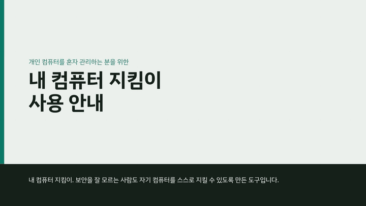
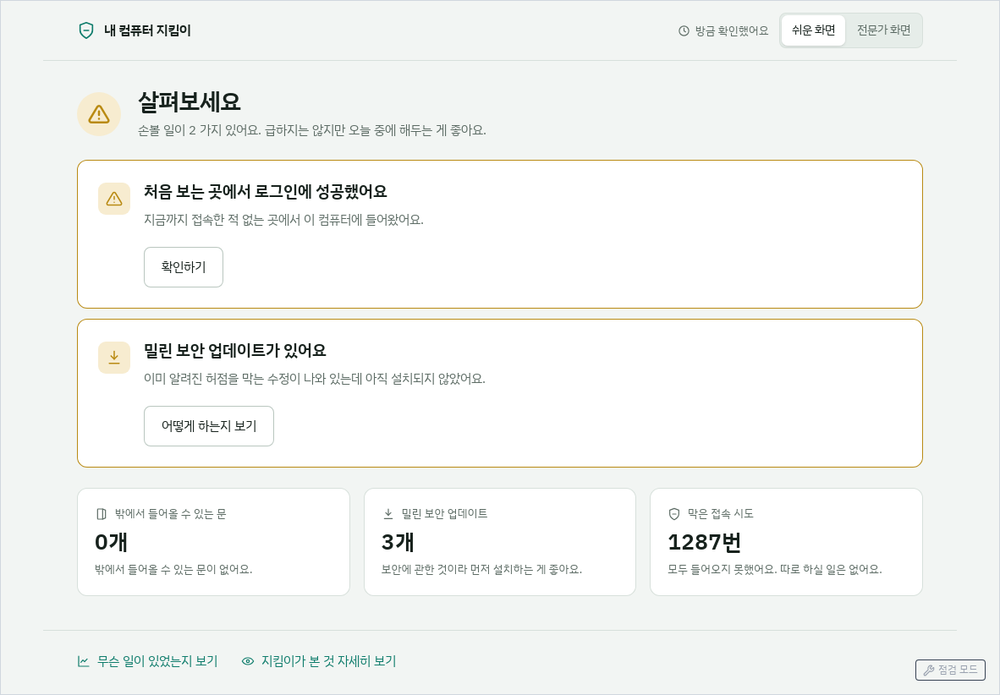
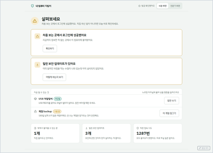
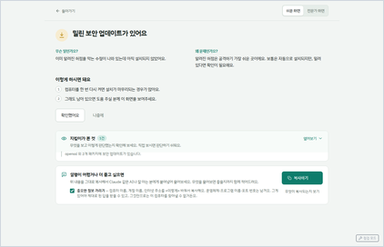
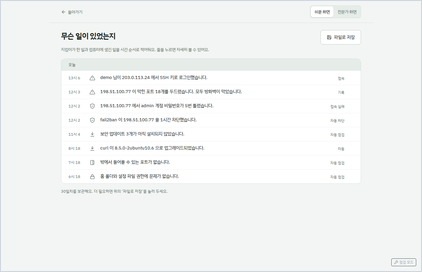
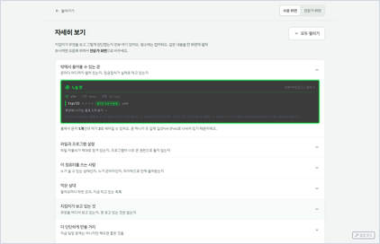
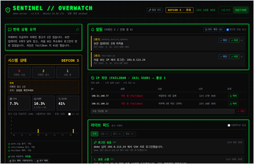
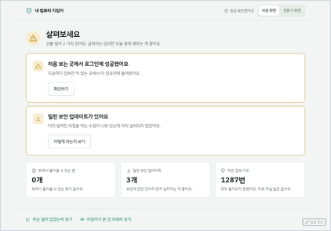

<p align="center">
  
</p>

<h1 align="center">Security Dashboard (Sentinel Overwatch)</h1>

<p align="center">
  중요 서버용 보안 관제 대시보드. <b>검증된 호스트 도구 위에서 동작하는 뷰/트리아지 계층</b>으로 설계되어 있다.
  탐지를 직접 재발명하기보다 fail2ban, rsyslog(auth.log), auditd, dpkg/apt, /proc, Lynis, Ubuntu USN 을 진실 원천으로 삼고,
  그 위에서 상관 분석 → 알림(Alert) → 한국어 조치 안내 → 확인/해결 워크플로를 제공한다.
</p>

<p align="center">
  <a href="https://github.com/KunmyonChoi/Sentinel-Overwatch/releases/download/tutorial-v1/sentinel-tutorial-1080p.mp4">
    
  </a>
</p>
<p align="center">
  <a href="https://github.com/KunmyonChoi/Sentinel-Overwatch/releases/download/tutorial-v1/sentinel-tutorial-1080p.mp4">▶ 사용 안내 영상 보기 (MP4 · 1080p · 25분)</a>
  · <a href="https://github.com/KunmyonChoi/Sentinel-Overwatch/releases/download/tutorial-v1/sentinel-tutorial-720p.mp4">720p</a>
</p>

```
 auth.log ──┐                                   ┌─ 알림 (OPEN → ACKED → RESOLVED)
 auditd ────┤                                   │   · 제목/요약/지금 할 일(한국어)
 fail2ban ──┤   모니터(사실 기록)   상관 규칙     │   · 근거(diff, 로그 줄, 최근 관리자 활동)
 dpkg/apt ──┼─▶ Event(원시) ───▶ Alert 엔진 ───▶┤   · Slack (속도 제한, 호스트명 접두사)
 /proc ─────┤                     (중복 억제)    │   · 점검 모드 중 계획 변경은 자동 확인
 Lynis ─────┤                                   │
 USN JSON ──┘                                   └─ DEFCON = 미확인 알림에서만 계산
```

- **[아키텍처 다이어그램](https://kunmyonchoi.github.io/Sentinel-Overwatch/architecture.html)** — 데이터 흐름, 브루트포스 사건의 경로, 알림 생애주기, 신뢰 경계, 설치·강화 경로<br>
  <sub>[원본](docs/architecture.html) · 운영 대시보드에서는 `/docs/architecture.html`</sub>
- **[방어 범위](https://kunmyonchoi.github.io/Sentinel-Overwatch/coverage.html)** — 차단·탐지·불가로 나눈 공격 패턴과 다음 조치<br>
  <sub>[원본](docs/coverage.html)</sub>

## 지원 환경

| 구성 | 확인한 환경 | 필요한 것 | 지원하지 않음 |
|---|---|---|---|
| 서버 (백엔드·웹 화면) | Ubuntu 24.04 LTS · x86_64 | systemd, apt/dpkg, rsyslog(`/var/log/auth.log`), Python 3.10 이상. fail2ban·auditd·Lynis 는 설치 스크립트가 넣는다 | RHEL·Fedora·Arch 같은 비 Debian 계열, macOS, Windows |
| 데스크톱 앱 | Ubuntu 24.04 LTS · amd64 (deb, AppImage) | glibc 2.39 이상, WebKitGTK 4.1, AppIndicator 트레이 | Ubuntu 22.04 이하(glibc 2.35), macOS, Windows |
| 웹 화면을 여는 컴퓨터 | — | 최신 Chrome·Firefox·Edge·Safari, 원격이면 SSH 터널 | — |
| 빌드 머신 (개발자) | Ubuntu 24.04 LTS | Node 20.19+ 또는 22.12+ (vite 7). 데스크톱 앱은 Rust stable 추가 | — |

- **시험하지 않은 환경.** Ubuntu 22.04 LTS, Debian 12·13, ARM64 는 같은 apt·systemd 도구를 쓰지만 확인하지 않았다.
- **Debian 에서는** 취약점 공지 대조가 비어 있다. USN 은 Ubuntu 릴리스별 공지라 Debian 코드네임과 맞는 항목이 없다. 뉴스와 다른 모니터는 영향이 없다.
- **데스크톱 앱 트레이는** Ubuntu 기본 데스크톱에서 보인다. 순수 GNOME 에서는 AppIndicator 확장을 켜야 한다.

## 설치와 사용

처음 쓰는 분을 위한 순서다. 코드를 빌드할 필요는 없다 — 만들어 둔 설치 파일을 받아 설치한다.

### 먼저 알아둘 말

- **서버** — 지킴이를 설치해 지킬 컴퓨터. 원격 서버일 수도, 지금 쓰는 내 PC 일 수도 있다.
- **터미널** — 명령을 글자로 입력하는 창. Ubuntu 데스크톱에서는 `Ctrl` + `Alt` + `T` 로 연다. 원격 서버라면 `ssh 사용자@서버주소` 로 접속한 창이 곧 서버의 터미널이다. 아래 회색 상자의 명령을 한 줄씩 붙여 넣고 `Enter` 를 누른다(`#` 뒤는 설명이라 입력하지 않아도 된다).
- **`sudo`** — 관리자 권한으로 실행한다는 뜻. 처음 한 번 **내 계정 비밀번호**를 묻는다. 입력하는 동안 화면에 글자가 보이지 않는 것이 정상이다.
- **API 토큰** — 지킴이 화면에 들어가기 위한 긴 비밀 문자열. 설치할 때 서버가 자동으로 만든다. 비밀번호처럼 다루고 다른 사람에게 보여주지 않는다.

### 1. 설치 파일 받기 (서버의 터미널에서)

```bash
cd ~
wget https://github.com/KunmyonChoi/Sentinel-Overwatch/releases/download/v1.0.0/secdash-1.0.0.tar.gz
wget https://github.com/KunmyonChoi/Sentinel-Overwatch/releases/download/v1.0.0/secdash-1.0.0.tar.gz.sha256
sha256sum -c secdash-1.0.0.tar.gz.sha256      # "secdash-1.0.0.tar.gz: OK" 가 나와야 한다
tar xzf secdash-1.0.0.tar.gz                  # secdash-1.0.0 폴더가 생긴다
```

`OK` 가 아니면 파일이 깨졌거나 바뀐 것이니 설치하지 말고 다시 받는다.

### 2. 설치하기

```bash
sudo secdash-1.0.0/deploy/install.sh
```

필요한 도구(fail2ban·auditd·Lynis)를 설치하고, 지킴이 전용 계정과 서비스를 만들어 켠다. 인터넷이 연결되어 있어야 하며 몇 분 걸린다.
끝나면 마지막에 이런 줄이 보인다.

```
  대시보드 : http://127.0.0.1:8000  (원격이면 ssh -L 8000:127.0.0.1:8000 <서버>)
  API 토큰 : 3f9c…(긴 문자열)
```

**API 토큰** 줄의 문자열이 5단계에서 넣을 토큰이다. 지금 복사해 두지 않아도 된다 — 언제든 다시 볼 수 있다.

### 3. 원격 서버라면: 내 IP 를 먼저 등록한다

같은 컴퓨터에 설치했다면 건너뛴다.

지킴이는 비밀번호를 여러 번 틀린 주소를 차단한다. 원격 서버에서 **내 주소가 차단되면 다시 접속할 수 없다**(최대 1주일). 그래서 설치 직후 내 주소를 "차단하지 않을 주소"로 등록한다.

```bash
echo $SSH_CLIENT | cut -d' ' -f1      # 서버가 보는 내 IP. 예: 203.0.113.7
```

나온 주소를 넣어 등록한다(아래 `203.0.113.7` 을 바꾼다). 집·사무실처럼 여러 곳에서 접속하면 공백으로 구분해 모두 적는다.

```bash
echo 'SECDASH_F2B_IGNOREIP=203.0.113.7' | sudo tee -a /etc/secdash/secdash.env
sudo secdash-1.0.0/deploy/apply-host-config.sh && sudo systemctl restart secdash
```

인터넷 공유기나 통신사가 주소를 자주 바꾸는 환경이면 주소가 바뀔 때마다 다시 등록해야 한다.

### 4. 화면 열기

지킴이 화면은 보안을 위해 **서버 자신(`127.0.0.1`)에서만** 열린다. 인터넷에 그대로 드러나지 않는다.

- **같은 컴퓨터에 설치했다면**: 브라우저 주소창에 `http://127.0.0.1:8000` 을 입력한다.
- **원격 서버라면**: 내 컴퓨터에서 SSH 터널을 연다. 터널은 "내 컴퓨터의 8000번 문을 두드리면 서버의 8000번 문으로 이어 주는" 암호화된 통로다. 내 컴퓨터의 터미널(Windows 는 PowerShell)에서:
  ```bash
  ssh -L 8000:127.0.0.1:8000 사용자@서버주소
  ```
  접속된 이 창은 **닫지 말고 둔 채로**, 내 컴퓨터 브라우저에서 `http://127.0.0.1:8000` 을 연다. 창을 닫으면 화면도 끊긴다.

### 5. 토큰 넣기 (처음 한 번)

화면을 처음 열면 **"API 토큰 필요"** 창이 뜬다.

1. 서버의 터미널에서 토큰을 표시한다. 토큰 파일은 지킴이 계정만 읽을 수 있어서 `sudo` 가 필요하다.
   ```bash
   sudo cat /opt/secdash/backend/.api_token
   ```
2. 나온 긴 문자열을 드래그해 복사한다(터미널에서는 `Ctrl` + `Shift` + `C`). 앞뒤 공백은 넣지 않아도 알아서 지운다.
3. 창의 입력칸에 붙여 넣고(`Ctrl` + `V`) **연결** 을 누른다. 입력한 글자는 `●` 로 가려져 보인다.

토큰은 **그 브라우저에만** 저장되어 다음부터는 묻지 않는다. 다른 브라우저, 다른 컴퓨터, 시크릿 창에서 열면 다시 묻는다.
토큰이 틀렸거나 서버에서 토큰이 바뀌면 같은 창이 다시 뜬다 — 1번부터 다시 하면 된다.

### 6. 데스크톱 앱 (선택, Ubuntu 24.04 이상 amd64)

브라우저 대신 자기 창을 가진 앱으로 연다. 화면 위쪽 막대(트레이)에 아이콘이 늘 떠서 지금 상태(이상 없음·살펴보세요·지금 확인하세요·알 수 없음)를 보여주고, 긴급 알림은 바탕화면 알림으로 띄운다.
앱은 **이 컴퓨터의 `127.0.0.1:8000`** 에 붙는다 — 같은 컴퓨터에 지킴이를 설치했거나, 4단계의 SSH 터널이 열려 있어야 한다.

<p align="center">
  
</p>
<p align="center"><sub>데스크톱 앱 첫 화면 (예시 데이터 — 실제 서버 정보가 아니다)</sub></p>

```bash
cd ~
wget https://github.com/KunmyonChoi/Sentinel-Overwatch/releases/download/desktop-v0.1.0/sentinel-overwatch_0.1.0_amd64.deb
wget https://github.com/KunmyonChoi/Sentinel-Overwatch/releases/download/desktop-v0.1.0/SHA256SUMS
sha256sum -c --ignore-missing SHA256SUMS      # "…deb: OK"
sudo apt install ./sentinel-overwatch_0.1.0_amd64.deb
```

앱 메뉴에서 **내 컴퓨터 지킴이**를 실행하고, 5단계와 같은 토큰을 한 번 넣는다. 앱에서는 토큰이 **OS 키링**(Ubuntu 의 '암호와 키')에 저장된다.
창을 닫아도 앱은 트레이에 남는다. 창은 트레이 아이콘을 눌러 나오는 메뉴의 **창 열기**로, 끝낼 때는 **종료**로. 자세한 내용은 [desktop/README.md](desktop/README.md).

### 업데이트

새 버전의 설치 파일을 1단계처럼 받아 풀고, 새 폴더의 `update.sh` 를 실행한다(`<버전>` 을 바꾼다). DB·토큰·설정은 그대로 남는다.

```bash
sudo secdash-<버전>/deploy/update.sh --deps
```

### 잘 안 될 때

| 증상 | 확인할 것 |
|---|---|
| 브라우저가 "연결할 수 없음" | 서비스가 켜져 있는지 `systemctl status secdash` (`active (running)` 이어야 함). 원격이면 SSH 터널 창이 열려 있는지 |
| 토큰 창이 계속 다시 뜬다 | `sudo cat /opt/secdash/backend/.api_token` 으로 다시 복사해 넣는다. 다른 서버의 토큰이 아닌지 |
| 모니터 상태가 "제한"·"중단" | 화면에 표시된 해결 명령을 서버에서 실행한다 |
| 무엇이 잘못됐는지 모르겠다 | `sudo journalctl -u secdash -n 50` 의 마지막 줄들을 본다 |

권한 모델, 호스트 도구 설정(fail2ban·auditd·Lynis), 강화 스크립트(`deploy/harden.sh`), 시뮬레이션 방법은 [deploy/README.md](deploy/README.md) 를 보라.

## 원칙

1. **조용히 실패하지 않는다.** 로그를 못 읽거나 fail2ban 을 제어할 수 없으면 모니터 상태가 `제한/중단` 으로 바뀌고 해결 명령이 표시된다. 테스트 파일로 대체하지 않는다.
2. **한 일만 말한다.** 실제 차단은 fail2ban 이 한다. 연동이 안 되면 "차단됨" 이 아니라 "차단 권고" 와 실행할 명령을 보여준다.
3. **호스트 로그는 외부로 나가지 않는다.** 한국어 문장은 구조화 필드 기반 템플릿으로 만든다. 외부 번역/AI 평가는 공개 뉴스 제목에만 쓴다.
4. **원시 이벤트와 알림을 분리한다.** 실패 로그 한 줄은 INFO 이벤트, "30분 내 5회 실패" 가 경고 알림, "실패 후 성공" 이 긴급 알림이다. 공개키 거부(`Failed publickey`)는 기록만 하고 실패 횟수에 세지 않는다(에이전트의 키가 차례로 거부된 줄이라 fail2ban 기본 필터도 세지 않는다). 알림을 확인(ack)하면 DEFCON 에서 빠진다.
5. **계획된 변경은 알림이 아니다.** 패키지 설치가 만든 cron/SUID/설정 파일, `systemctl mask` 링크, snap 갱신은 소유 패키지와 최근 패키지 작업을 대조해 정보 이벤트로만 남긴다. 운영자는 점검 모드를 켜서 작업 중 알림을 자동 확인 처리할 수 있다. sudoers, sshd_config, authorized_keys, ld.so.preload, 그리고 모든 침입 신호는 예외 없이 알린다.
6. **판단에 필요한 근거를 함께 준다.** 프로세스명·실행 파일·사용자·부모, 파일 diff 와 추가된 키/계정, 누가 방금 어떤 sudo 명령을 실행했는지, 취약한 패키지와 수정 버전.
7. **관리자 자신을 차단하지 않는다.** 원격 서버에서 관리자 IP 가 막히면 다시 들어올 수 없다. 대시보드는 차단하기 전에 관리자 대역(`SECDASH_F2B_IGNOREIP`), fail2ban 의 `ignoreip`, 로그인을 마친 SSH 세션의 주소를 거르고, 걸리면 차단하지 않고 '차단 보류'와 이유를 남긴다. fail2ban 의 `ignoreip` 는 `fail2ban-client set … banip` 을 막지 않으므로 대시보드가 따로 거른다.

## 화면 구성

| 패널 | 내용 | 운영자가 하는 일 |
|---|---|---|
| 현재 상황 요약 | 미확인 알림, 탐지 공백, 24h 로그인 실패/성공, 차단 IP, 미적용 보안 업데이트, Lynis 지수를 한 문단으로 | 하루 한 번 읽기 |
| 시스템 상태 | DEFCON, 미확인 긴급/경고/대응 중 수, 리소스, 24h 타임라인, 실행 권한 점검, USB 저장장치 차단 상태와 해제/재차단 명령 | 레벨이 SAFE 가 아니면 알림 패널로 |
| 알림 | OPEN/ACKED 알림. 제목·요약·**지금 할 일**·근거(diff, 로그 줄, 최근 관리자 활동). 확인/해결/모두 확인 | 알림마다 확인(ack) 또는 해결(resolve) |
| 모니터 상태 | 15개 모니터의 health(정상/제한/중단), 사유, 해결 명령 복사 | 제한/중단이 보이면 그 명령 실행 |
| 계정 상태 | root 와 사람 계정의 잠김/만료, sudo·docker 그룹, SSH 키, 마지막 로그인·출발지, 180일 미사용 표시, 잠금/되살리기 명령 | 쓰지 않는 계정 잠그기 |
| 강화 작업 목록 | Lynis 강화 지수, 경고, 제안. 제안은 알림이 아니라 백로그 | 주 1회, 항목마다 적용/수용/해결 결정 |
| 위협 인텔 | 보안 뉴스 + Ubuntu USN. 설치 패키지에 실제 영향 있는 공지는 "이 서버 영향" 배지 | 배지가 붙은 것만 처리 |
| IP 차단 | fail2ban 의 실제 차단 목록(sshd, recidive), 수동 차단/해제, 미연동 시 차단 권고 명령 | 관리자 IP 가 차단되면 해제 |
| 라이브 피드 | 원시 이벤트(한국어 + 원문). 시뮬레이션은 TEST DATA 표시 | 알림의 근거를 찾을 때 |
| 점검 모드 (헤더) | 시간과 메모를 정하면 그동안의 설정·패키지·영속화 알림은 자동 확인, 침입 신호는 그대로 | 계획 작업 전에 켜기 |
| 지금 할 수 있는 것 (쉬운 화면 홈) | USB 저장장치 차단 상태와 잠깐 쓰기/다시 막기, 안 쓰는 계정 잠금·되살리기. 누르면 터미널에 붙여 넣을 명령과 무엇이 바뀌는지를 보여준다 (최대 세 줄) | USB 를 잠깐 쓸 때, 안 쓰는 계정을 잠글 때 |

### 화면 예시

작은 그림을 누르면 원본 크기로 볼 수 있다. 모두 **예시 데이터**이며 실제 서버 정보가 아니다.

<table>
  <tr>
    <td width="50%" align="center">
      <a href="docs/images/screens/plain-home.png"></a><br>
      <b>쉬운 화면 — 홈</b><br><sub>지금 상태 한 줄, 할 일 카드, 안심 정보 세 칸</sub>
    </td>
    <td width="50%" align="center">
      <a href="docs/images/screens/plain-task.png"></a><br>
      <b>할 일 상세</b><br><sub>무슨 일·왜 문제·순서, 근거, 가리고 복사하기</sub>
    </td>
  </tr>
  <tr>
    <td width="50%" align="center">
      <a href="docs/images/screens/plain-history.png"></a><br>
      <b>무슨 일이 있었는지</b><br><sub>지킴이가 한 일과 생긴 일을 시간 순서로 · 파일로 저장</sub>
    </td>
    <td width="50%" align="center">
      <a href="docs/images/screens/plain-expert.png"></a><br>
      <b>자세히 보기</b><br><sub>전문가 패널을 쉬운 말 설명과 함께 접이식으로</sub>
    </td>
  </tr>
  <tr>
    <td width="50%" align="center">
      <a href="docs/images/screens/expert-dashboard.png"></a><br>
      <b>전문가 화면</b><br><sub>요약·DEFCON·알림·차단 목록·라이브 피드를 한 화면에</sub>
    </td>
    <td width="50%" align="center">
      <a href="docs/images/desktop-app.png"></a><br>
      <b>데스크톱 앱</b><br><sub>같은 화면을 트레이 상주 앱으로 · 긴급 알림은 OS 알림</sub>
    </td>
  </tr>
</table>

## 탐지 항목

| 모니터 | 소스 | 알림 규칙 |
|---|---|---|
| AuthLogWatcher | auth.log | 브루트포스, 실패 후 성공(긴급), 새 공인 IP 로그인, root 직접 로그인, sudo 실패, 계정/권한 그룹 변경 |
| AuditMonitor | auditd (`deploy/audit-secdash.rules`) | 대화형 세션의 모든 execve(도구·쓰기 가능한 임시 디렉터리 실행 즉시 탐지, 같은 실행 파일의 반복 실행은 `SECDASH_EXEC_DEDUP_SEC` 창으로 묶음), 핵심 파일 쓰기의 주체, ld.so.preload 쓰기(긴급), 커널 모듈 로드 |
| Fail2banSync | `fail2ban-client banned` | sshd·recidive jail 차단 목록 동기화, 수동 차단/해제, jail 비활성 시 제한 표시 |
| FirewallLogWatcher | ufw 차단 로그(`/var/log/ufw.log`) | 막힌 포트 스캔은 이벤트와 하루 요약으로만 남김(알림 아님). 스캔한 IP 가 24시간 안에 SSH 로그인 시도·성공하거나 리스닝 포트에 실제로 연결하면 경고, 내부망 주소의 스캔은 곧바로 경고. 숫자는 최소치, 자동 차단 없음 |
| NetworkWatcher | /proc/net | 외부 인터페이스 새 리스너(프로세스 포함, 그 포트가 닫히면 자동 해결), 새 외부 연결, 포트 스캔(저신뢰) |
| ProcessAudit | /proc (30초 샘플링, auditd 폴백) | 셸 stdin/stdout 이 소켓(리버스 셸, 긴급), **쓰기 가능한** /tmp·/dev/shm 실행(읽기 전용 이미지 마운트는 정보 이벤트만), 삭제된 실행 파일, 공격/진단 도구 실행 |
| IntegrityMonitor | sha256 + DB 기준선 | passwd/group/shadow/sudoers(.d)/sshd_config(.d)/authorized_keys/ld.so.preload/modprobe.d/sysctl.d — diff 와 최근 관리자 활동 첨부, 서비스 중지 중 변경도 탐지 |
| PersistenceMonitor | cron, systemd, SUID | 새/변경된 cron·유닛(curl\|sh, /dev/tcp 패턴이면 긴급), 새 SUID/SGID. 패키지 소유·mask 링크·snap 유닛은 정보만 |
| UpdateMonitor | dpkg.log, apt | 패키지 제거(보안 패키지면 긴급, 누가 실행했는지 첨부, 다시 설치되면 자동 해결), 미적용 보안 업데이트, 재부팅 대기 (적용/재부팅 시 자동 해결) |
| ResourceMonitor | psutil, timedatectl | CPU/메모리/디스크/프로세스 급증, NTP 동기화 끊김 (해소 시 자동 해결) |
| IntelMonitor | 뉴스 RSS, Ubuntu USN | USN 영향 패키지 ↔ 설치 버전 대조 → 이 서버에 실제 영향 있는 공지만 알림 |
| LynisMonitor | Lynis 크론 결과 | 새 경고 알림, 사라지면 자동 해결, 강화 지수 하락 알림, 제안은 강화 작업 목록으로 표시 |

## 운영 리듬

- **매일**: 요약 문단과 DEFCON 만 본다. 알림이 있으면 "지금 할 일" 대로 처리하고 확인(ack) 또는 해결(resolve).
- **계획 작업 전**: 점검 모드를 켠다(15분~4시간, 메모 필수). 무결성·영속화·패키지·리스너·모듈·Lynis 알림은 자동 확인되고 근거만 남는다.
- **주 1회**: 강화 작업 목록에서 새 항목만 결정한다. "Claude 에 붙여넣기용 복사" 로 호스트 역할·상세·이미 결정한 항목이 담긴 브리프를 복사해 의논하고, 수용/해결로 정한 항목은 `deploy/lynis-custom.prf` 에 `skip-test=` 로, 적용할 항목은 `deploy/harden.sh` 에 넣는다.
- **알림이 늘었다고 느낄 때**: 원인이 대시보드 자신이거나 계획 변경이면 코드나 정책을 고친다. 알림을 일일이 지우는 것은 해결이 아니다.

## 설정

운영에서는 `/etc/secdash/secdash.env`(예시: `deploy/secdash.env.example`), 개발에서는 `backend/.env` 또는 환경 변수. 고친 뒤 `sudo systemctl restart secdash`. 전체 목록은 `backend/config.py`.

| 변수 | 기본값 | 설명 |
|---|---|---|
| `SECDASH_HOST` / `SECDASH_PORT` | 127.0.0.1 / 8000 | 바인드 주소. 외부 노출 대신 SSH 터널 사용 |
| `SECDASH_API_TOKEN` | 자동 생성(`backend/.api_token`) | API 토큰 고정 |
| `SECDASH_HOSTNAME` | 시스템 호스트명 | Slack 알림 제목 접두사, 대시보드 헤더 |
| `SECDASH_HOST_ROLE` | – | 서버 역할 메모. 강화 작업 목록의 "Claude 에 붙여넣기용 복사" 본문에 포함 |
| `SECDASH_AUTH_LOG` / `SECDASH_DPKG_LOG` | /var/log/auth.log, /var/log/dpkg.log | 로그 경로 (시뮬레이션 시 테스트 파일) |
| `SECDASH_FAIL2BAN_JAIL` / `SECDASH_FAIL2BAN_JAILS` | sshd / sshd,recidive | 차단 요청 jail / 동기화 대상 jail |
| `SECDASH_BRUTE_THRESHOLD` / `SECDASH_BRUTE_WINDOW_MIN` | 5 / 30 | 브루트포스 판정 (공개키 거부는 세지 않음) |
| `SECDASH_UFW_LOG` | /var/log/ufw.log | ufw 차단 로그 경로 (`adm` 그룹이면 읽힘, 시뮬레이션 시 테스트 파일) |
| `SECDASH_SCAN_PORTS` / `SECDASH_SCAN_WINDOW_SEC` | 10 / 60 | 같은 IP 가 이 시간(초) 안에 막힌 포트 N개 이상(TCP SYN·UDP)을 두드리면 스캔 이벤트 |
| `SECDASH_SCAN_FOLLOWUP_HOURS` | 24 | 스캔한 IP 의 SSH 시도·실제 연결을 경고로 올리는 기간 |
| `SECDASH_F2B_IGNOREIP` | – | 관리자 IP·대역(공백 구분). 대시보드가 차단하지 않고, `apply-host-config.sh` 가 fail2ban `ignoreip` 에도 넣는다. **원격 서버라면 반드시** |
| `SECDASH_SSH_PORTS` | 22 | 로그인해 있는 관리자 SSH 세션을 알아보는 포트 (차단 보호용) |
| `SECDASH_NETWORK_IGNORE_PROCESSES` | – | 외부 연결 이벤트에서 제외할 프로세스 (예: `firefox,chrome`) |
| `SECDASH_TMP_EXEC_ALLOW` | – | 임시 디렉터리 실행 판정에서 제외할 실행 파일 경로 패턴(쉼표 구분, `*` 글롭). 읽기 전용으로 자기를 마운트하는 프로그램(AppImage 등)은 코드가 이미 거르므로 보통 비워 둔다. 쓰기 가능한 경로를 넣으면 그만큼 눈을 감는 것이다 |
| `SECDASH_EXEC_DEDUP_SEC` | 60 | 같은 실행 파일의 execve 가 이 시간(초) 안에 반복되면 알림 횟수를 올리지 않는다 |
| `SLACK_WEBHOOK_URL` / `SECDASH_NOTIFY_MAX_PER_MINUTE` | – / 10 | 알림 발송, 분당 제한(초과분 집계) |
| `ANTHROPIC_API_KEY`, `SECDASH_INTEL_TRANSLATE` | –, 1 | 뉴스 제목 번역/긴급도 (호스트 로그 미전송) |
| `SECDASH_INTEL_FEEDS` / `SECDASH_USN_FEED` / `SECDASH_USN_MATCH` | THN RSS / Ubuntu USN / 1 | 인텔 소스, USN ↔ 설치 패키지 대조 |
| `SECDASH_EVENT_RETENTION_DAYS` / `SECDASH_ALERT_RETENTION_DAYS` | 30 / 90 | 보존 기간 (기동 1시간 뒤부터 적용) |
| `SECDASH_ACKED_AGE_DAYS` | 30 | 확인(ack)만 된 채 이 기간 동안 다시 관찰되지 않은 **상태 계열** 알림을 자동 해결로 정리 (0 이면 끄기). 침입 신호는 정리하지 않고 남겨둔 건수를 이벤트로 남긴다 |

## 한계 (알고 쓰기)

- 포트 스캔은 ufw 가 **막은** 포트에 대해서만 방화벽 로그(`FirewallLogWatcher`)로 본다. 스캔 자체는 알림이 아니고, 스캔 뒤 SSH 시도·실제 연결이 이어지거나 내부망 주소가 스캔할 때만 경고한다. 보지 못하는 것:
  - **Docker 가 게시한 포트**: Docker 는 ufw 규칙보다 앞에서 패킷을 넘기므로 ufw 로그에 남지 않는다.
  - **정확한 횟수**: ufw 는 `logging low`~`high` 에서 차단 기록을 모든 IP 합산 분당 3건(한 번에 10건까지)으로 제한한다. 숫자는 최소치이고, 여러 곳이 동시에 두드리면 스캔 자체를 놓칠 수 있다. `logging full` 은 제한이 없지만 기록이 매우 많아진다.
  - **허용된 포트에 대한 스캔**: 막히지 않으니 기록이 없다. 이건 여전히 NetworkWatcher 의 소켓 표 휴리스틱(저신뢰)뿐이다. FIN·NULL·Xmas 스캔(SYN 없는 TCP)도 스캔으로 세지 않는다.
  - **ufw 가 아닌 방화벽**(nftables 직접 규칙, firewalld, 클라우드 보안 그룹)의 기록은 읽지 않는다. 필요하면 IDS(Suricata 등)를 붙여라.
  - 시작할 때는 파일 끝부터 읽는다(재시작 전 기록은 다시 읽지 않는다). 하루 요약은 대시보드가 켜져 있던 동안만 센다.
- 확인(ack)만 된 알림은 30일(`SECDASH_ACKED_AGE_DAYS`) 뒤 "시간이 지나 닫혔다"는 메모와 함께 자동 해결로 정리된다. 상태 계열 규칙만 대상이다. 정리 시점에 그 조건이 아직 남아 있는지를 다시 확인하지는 않으므로, 노출 포트·파일 권한·컨테이너 설정이 여전히 그대로라면 해당 모니터가 다시 기동할 때(서비스 재시작) 새 알림으로 올라온다. 침입 신호는 정리하지 않는다 — 그 목록은 사람이 해결로 닫아야 줄어든다.
- 파일 무결성은 자체 해시다. 규제 요건이 있으면 AIDE 를 병행하고 이 대시보드는 표시 계층으로 써라.
- auditd 가 없으면 프로세스 실행 이력(execve)은 30초 샘플링으로만 본다. `deploy/install.sh` 는 auditd 와 최소 규칙을 설치해 이 공백을 메운다.
- **임시 디렉터리 실행**은 경로 이름만으로 판단하지 않는다. 이 규칙이 잡으려는 것은 '`/tmp` 라는 이름' 이 아니라 '아무나 파일을 떨어뜨릴 수 있는 자리에서의 실행' 이다. 경로가 `/tmp` 안이라도 읽기 전용으로 마운트된 이미지(AppImage 의 자기 마운트, squashfs, ISO) 안의 파일이면 그 자리에는 페이로드를 떨어뜨릴 수 없으므로 알림이 아니라 정보 이벤트로 실행 파일마다 한 번만 남긴다. 그래서 보지 못하는 것:
  - **읽기 전용 이미지 안에 이미 심어진 코드**: 이미지의 서명을 확인하지 않는다. 공격자가 AppImage 나 squashfs 이미지 자체를 바꿔치기해 건네줬다면 그 안에서의 실행은 걸러진다. 이미지 파일(`~/Applications/*.AppImage` 등)의 출처와 해시는 따로 확인해야 한다.
  - **마운트가 사라진 뒤의 `.mount_*` 경로**: AppImage 가 새 버전으로 교체되면 아직 돌고 있는 예전 프로세스의 경로가 '지워진 파일' 로 보인다. `.mount_*` 디렉터리까지 사라진 경우만 그 잔상으로 보고 넘긴다. 공격자가 `/tmp/.mount_xxx/` 라는 이름의 디렉터리를 만들어 페이로드를 실행한 뒤 그 디렉터리째 지우면 이 경우에 섞일 수 있다.
  - `SECDASH_TMP_EXEC_ALLOW` 에 넣은 경로는 그만큼 눈을 감는 것이다. 쓰기 가능한 경로는 넣지 마라.
- auditd 는 대화형 세션의 execve 를 전부 흘려보내므로, 같은 실행 파일의 반복 실행은 `SECDASH_EXEC_DEDUP_SEC`(기본 60초) 창으로 묶는다. 알림의 '발생 횟수' 는 실행 횟수가 아니라 '그 창에서 적어도 한 번 실행된 횟수' 다. 정확한 실행 횟수가 필요하면 auditd 로그를 직접 봐야 한다.
- 데스크톱 앱은 같은 컴퓨터의 백엔드(`127.0.0.1:8000`)에만 붙는다. 원격 서버를 보려면 SSH 터널을 직접 열어 둔다. Linux 트레이(AppIndicator)는 아이콘 클릭을 받지 않아 창은 트레이 메뉴로 연다.
- 서버 한 대 단위다. 여러 서버를 한 화면에서 보려면 Wazuh 같은 중앙 관리 도구가 필요하며, 그때 이 대시보드는 그 위의 한국어 트리아지 뷰로 쓸 수 있다.
- 제거 스크립트는 아직 없다.

## 개발자용

### 개발 실행

```bash
./start.sh          # backend 127.0.0.1:8000 + vite 127.0.0.1:5173
```

`start.sh` 는 백엔드 토큰을 `frontend/.env.local` 의 `VITE_API_TOKEN` 에 적어 개발 화면에 **자동 주입**한다. 그래서 개발 중에는 토큰 창이 뜨지 않는다.
이 파일이 남은 채 운영용 화면을 빌드하면 토큰이 화면 코드에 박히므로, 운영 빌드는 반드시 비워서 한다(`VITE_API_TOKEN= npx vite build`). `deploy/build-release.sh` 와 `desktop` 빌드는 알아서 비운다.
같은 컴퓨터에 운영 인스턴스가 8000 을 쓰고 있으면 `SECDASH_PORT=8001 SECDASH_UI_PORT=5174 ./start.sh`.

### 설치 파일 직접 만들기

운영 구성은 전용 계정 + capability + sudoers + systemd 다. 대상 서버에는 python3-venv 와 apt 만 있으면 된다.

```bash
# 빌드 머신에서
deploy/build-release.sh            # dist-release/secdash-<version>.tar.gz + .sha256  (--wheels: 오프라인용 pip 휠 포함)

# 대상 서버에서
sha256sum -c secdash-1.0.0.tar.gz.sha256 && tar xzf secdash-1.0.0.tar.gz
sudo secdash-1.0.0/deploy/install.sh
```

저장소를 직접 clone 해 `sudo deploy/install.sh` 로 설치할 수도 있다. 이때는 화면을 빌드하므로 Node 20.19+ 가 필요하다 — **Ubuntu 24.04 의 apt `nodejs` 는 18.19 라 빌드되지 않는다**(nvm 등으로 설치).
저장소에서 `update.sh` 를 돌릴 때 개발 토큰이 `frontend/dist` 에 박혀 있으면 웹 화면은 올리지 않고 알린다. 먼저 `(cd frontend && VITE_API_TOKEN= npx vite build)` 로 다시 빌드한다.

### 데스크톱 앱 빌드

```bash
cd desktop && npm ci && npm run build
# → src-tauri/target/release/bundle/deb/…deb, bundle/appimage/…AppImage
```

준비할 패키지, 개발 실행, 보안 설정(CSP·키링)은 [desktop/README.md](desktop/README.md) 를 보라.

### API

모든 `/api` 요청은 `X-API-Token` 헤더가 필요하다 (`backend/.api_token` 또는 `SECDASH_API_TOKEN`). 커스텀 헤더라 브라우저 CSRF 로는 호출할 수 없다.

| 경로 | 설명 |
|---|---|
| `GET /api/stats` | DEFCON(미확인 알림 기반), 24h 집계, 리소스, 탐지 공백, 점검 모드 |
| `GET /api/alerts?status=active\|all&limit=` · `POST /api/alerts/{id}/ack\|resolve` | 알림 조회(`limit` 기본 100·최대 500)/확인/해결 |
| `GET /api/alerts/count?status=active\|all` | 목록과 같은 조건의 전체 건수 (`total`·`open`·`acked`·`resolved`·`open_critical`·`open_warning`·`simulation`·`max_limit`). 머리글 숫자는 불러온 행이 아니라 이 값을 쓴다 |
| `POST /api/alerts/ack-all` | 미확인 알림 일괄 확인 (`ids` 또는 `rule`, 메모) |
| `GET/POST/DELETE /api/maintenance` | 점검 모드 조회/시작(`minutes`, `note`)/종료 |
| `GET /api/events` | 원시 이벤트 (`include_simulation=false` 로 테스트 제외, `limit` 기본 100·최대 500) |
| `GET /api/events/count` | 목록과 같은 조건(`include_simulation`, `severity`)의 전체 건수 (`total`·`max_limit`) |
| `GET /api/blocked` · `POST /api/blocked` · `POST /api/blocked/{ip}/unblock` | fail2ban 차단 목록/수동 차단/해제 |
| `GET /api/monitors` | 모니터 health(ok/degraded/down), 사유, 해결 힌트 |
| `GET /api/host` | 호스트, 버전, 실행 권한 점검, 미적용 업데이트, USB 저장장치 차단 상태 |
| `GET /api/accounts` | root 와 사람 계정의 잠김/만료, 권한 그룹, SSH 키, 마지막 로그인 |
| `GET /api/hardening` · `GET /api/hardening/brief?item=` | Lynis 강화 지수·경고·제안 / 대화형 도구에 붙여넣을 마크다운 브리프 |
| `GET /api/intel` | 뉴스 + USN (이 서버 영향 여부) |
| `GET /api/summary/korean` | 현재 상황 한국어 요약 |

### 테스트

```bash
cd backend && venv/bin/python -m pytest -q tests     # 파서·상관 규칙·알림 엔진·점검 모드·무결성·auditd·Lynis·fail2ban·계정·API
cd frontend && npm test                              # 쉬운 화면의 판정(할 일 분류·홈 첫 문장·지금 할 수 있는 것)과 트레이 알림
python3 simulate_attack.py                            # 탐지 파이프라인 점검 (TEST DATA 로 표시, DEFCON/Slack/fail2ban 영향 없음)
./clear_simulation.sh                                 # 시뮬레이션 흔적 정리
```

PR 을 올리기 전에 백엔드 `pytest` 와 프런트엔드 `npm test` 가 모두 통과해야 한다.
프런트엔드는 고쳐가며 볼 때 `npm run test:watch` 를 쓴다 (Node 20.19+).

## 라이선스

Apache License 2.0. [LICENSE](LICENSE) 를 보라. 번들·설치되는 제3자 구성요소와 라이선스는 [THIRD_PARTY_NOTICES.md](THIRD_PARTY_NOTICES.md) 에 있으며 `deploy/gen-notices.py` 로 생성한다(릴리스 빌드 시 자동).
